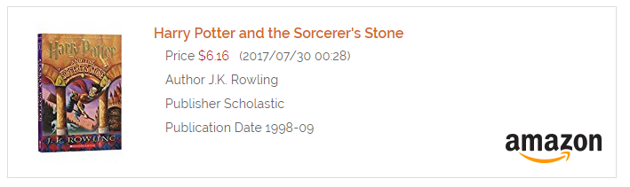
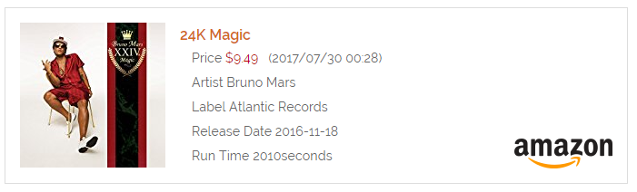
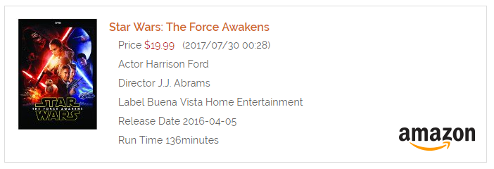

# Amazon Products Plugin

The **Amazon Products** Plugin is for [Grav CMS](http://github.com/getgrav/grav). Displays Amazon products by ASIN/ISBN-10 on your pages.

## Installation

Installing the Amazon plugin can be done in one of two ways. The GPM (Grav Package Manager) installation method enables you to quickly and easily install the plugin with a simple terminal command, while the manual method enables you to do so via a zip file.

### GPM Installation (Preferred)

The simplest way to install this plugin is via the [Grav Package Manager (GPM)](http://learn.getgrav.org/advanced/grav-gpm) through your system's terminal (also called the command line).  From the root of your Grav install type:

    bin/gpm install amazon-products

This will install the Amazon plugin into your `/user/plugins` directory within Grav. Its files can be found under `/your/site/grav/user/plugins/amazon-products`.

### Manual Installation

To install this plugin, just download the zip version of this repository and unzip it under `/your/site/grav/user/plugins`. Then, rename the folder to `amazon-products`. You can find these files on [GitHub](https://github.com/kinformation/grav-plugin-amazon-products) or via [GetGrav.org](http://getgrav.org/downloads/plugins#extras).

You should now have all the plugin files under

    /your/site/grav/user/plugins/amazon-products

> NOTE: This plugin is a modular component for Grav which requires [Grav](http://github.com/getgrav/grav) and the [Error](https://github.com/getgrav/grav-plugin-error) and [Problems](https://github.com/getgrav/grav-plugin-problems) to operate.

## Configuration

Before configuring this plugin, you should copy the `user/plugins/amazon-products/amazon-products.yaml` to `user/config/plugins/amazon-products.yaml` and only edit that copy.

Here is the default configuration and an explanation of available options:

```yaml
enabled: true
keys:
  accessKeyId: "your AWS Access Key ID"
  secretAccessKey: "your AWS Secret Access Key"
  associateTag: "your Amazon AssociateTag"
locale: "US"
```

* accessKeyId: (required) AWS Access Key ID for Product Advertising API.
* secretAccessKey: (required) AWS Secret Access Key for Product Advertising API.
* associateTag: Amazon Associate Tag.
* locale: (Default:US) Amazon locale. Select US, CA, CN, DE, ES, FR, IT, JP or UK.

This plugin requires [Amazon Product Advertising API](https://affiliate-program.amazon.com/gp/advertising/api/detail/main.html) Access Key ID and Secret Access Key.
Please register with AWS and obtain Access Key ID and Secret Key.

## Usage

```
[amazon asin=059035342X][/amazon]
or
[amazon asin=https://www.amazon.com/Harry-Potter-Sorcerers-Stone-Rowling/dp/059035342X/ref=sr_1_1...][/amazon]
```
* asin: (required) ASIN (ProductID of Amazon) or ISBN-10 (Book) or Amazon Products URL

### Book

```
[amazon asin=059035342X][/amazon]
```


### Music CD

```
[amazon asin=B01LX4X7K0][/amazon]
```


### Video

```
[amazon asin=B01B80CM4W][/amazon]
```


### Other

```
[amazon asin=B015WXL0C6][/amazon]
```

